# UML, ERD & LRS — SIM Kebersihan Puskesmas Cempaka Putih

**Sistem:** Sistem Informasi Monitoring dan Penilaian Kinerja Cleaning Service  
**Versi:** 2.0 | **Tanggal:** September 2026  
**Dibuat berdasarkan:** Implementasi aktual (Laravel 10, MySQL)

---

## Daftar Isi

1. [ERD (Entity Relationship Diagram)](#1-erd)
2. [LRS (Logical Record Structure)](#2-lrs)
3. [Use Case Diagram](#3-use-case-diagram)
4. [Activity Diagram](#4-activity-diagram)
5. [Sequence Diagram](#5-sequence-diagram)
6. [Class Diagram](#6-class-diagram)

---

## 1. ERD

### 1.1 ERD Konseptual (Crow's Foot Notation)

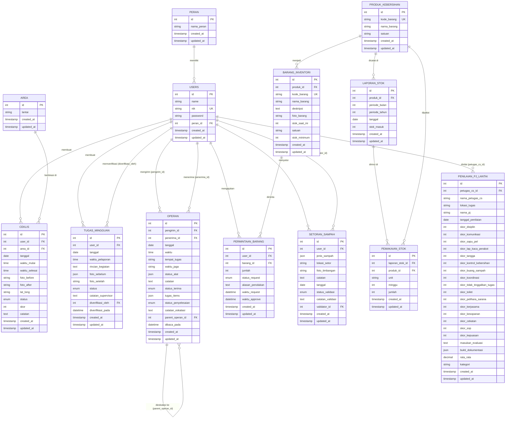

---

### 1.2 Kardinalitas Relasi

| Entitas Asal | Kardinalitas | Entitas Tujuan | Keterangan |
|---|---|---|---|
| `peran` | 1 — N | `users` | Satu peran dimiliki banyak pengguna |
| `users` | 1 — N | `ceklis` | Satu CS membuat banyak ceklis |
| `area` | 1 — N | `ceklis` | Satu area punya banyak ceklis |
| `users` | 1 — N | `tugas_mingguan` | Satu CS punya banyak tugas |
| `users` | 1 — N | `operan` (pengirim) | Satu user kirim banyak operan |
| `users` | 1 — N | `operan` (penerima) | Satu user terima banyak operan |
| `operan` | 0..1 — N | `operan` (self) | Eskalasi: satu operan jadi induk banyak operan baru |
| `users` | 1 — N | `permintaan_barang` | Satu CS ajukan banyak permintaan |
| `barang_inventori` | 1 — N | `permintaan_barang` | Satu barang diminta berkali-kali |
| `produk_kebersihan` | 1 — 1 | `barang_inventori` | Satu produk → satu stok inventori |
| `produk_kebersihan` | 1 — N | `laporan_stok` | Satu produk dicatat di banyak periode |
| `laporan_stok` | 1 — N | `pemakaian_stok` | Satu laporan punya banyak pemakaian per unit |
| `users` | 1 — N | `setoran_sampah` | Satu CS setor banyak kali |
| `users` | 1 — N | `penilaian_pj_lantai` | Satu CS dinilai berkali-kali |

---

## 2. LRS

**LRS (Logical Record Structure)** menggambarkan struktur tabel relasional lengkap dengan tipe data, constraint, dan relasi foreign key.

---

### 2.1 Tabel `peran`

```
PERAN
├── id              : INT(11)        NOT NULL  AUTO_INCREMENT  [PK]
├── nama_peran      : VARCHAR(50)    NOT NULL  UNIQUE
├── created_at      : TIMESTAMP      NULL
└── updated_at      : TIMESTAMP      NULL

Nilai valid: admin | supervisor | pj_lantai | cs | gudang
```

---

### 2.2 Tabel `users`

```
USERS
├── id              : INT(11)        NOT NULL  AUTO_INCREMENT  [PK]
├── name            : VARCHAR(255)   NOT NULL
├── nik             : VARCHAR(50)    NOT NULL  UNIQUE
├── password        : VARCHAR(255)   NOT NULL
├── peran_id        : INT(11)        NOT NULL  [FK → peran.id]
├── remember_token  : VARCHAR(100)   NULL
├── created_at      : TIMESTAMP      NULL
└── updated_at      : TIMESTAMP      NULL

FK: peran_id → peran(id) ON DELETE RESTRICT
```

---

### 2.3 Tabel `area`

```
AREA
├── id              : INT(11)        NOT NULL  AUTO_INCREMENT  [PK]
├── lantai          : VARCHAR(100)   NOT NULL
├── created_at      : TIMESTAMP      NULL
└── updated_at      : TIMESTAMP      NULL

Contoh nilai lantai: "Lantai 1", "Lantai 2", ..., "CSSD", "Rawasari"
```

---

### 2.4 Tabel `ceklis`

```
CEKLIS
├── id              : INT(11)        NOT NULL  AUTO_INCREMENT  [PK]
├── user_id         : INT(11)        NOT NULL  [FK → users.id]
├── area_id         : INT(11)        NOT NULL  [FK → area.id]
├── tanggal         : DATE           NOT NULL
├── waktu_mulai     : TIME           NULL
├── waktu_selesai   : TIME           NULL
├── foto_before     : VARCHAR(255)   NULL      (path storage/public)
├── foto_after      : VARCHAR(255)   NULL      (path storage/public)
├── lat_long        : VARCHAR(100)   NULL      (format: "-6.123,106.456")
├── status          : ENUM           NOT NULL  DEFAULT 'belum'
│                     ['belum','proses','selesai']
├── skor            : INT(1)         NULL      (1–5, dari supervisor)
├── catatan         : TEXT           NULL      (catatan supervisor)
├── created_at      : TIMESTAMP      NULL
└── updated_at      : TIMESTAMP      NULL

FK: user_id → users(id) ON DELETE CASCADE
FK: area_id → area(id) ON DELETE RESTRICT
```

---

### 2.5 Tabel `tugas_mingguan`

```
TUGAS_MINGGUAN
├── id                  : INT(11)       NOT NULL  AUTO_INCREMENT  [PK]
├── user_id             : INT(11)       NOT NULL  [FK → users.id]
├── tanggal             : DATE          NOT NULL
├── waktu_pelaporan     : TIME          NOT NULL
├── rincian_kegiatan    : TEXT          NOT NULL
├── foto_sebelum        : JSON          NULL      (array path, maks 5)
├── foto_setelah        : VARCHAR(255)  NULL      (path storage/public)
├── status              : ENUM          NOT NULL  DEFAULT 'proses'
│                         ['proses','selesai','disetujui']
├── catatan_supervisor  : TEXT          NULL
├── diverifikasi_oleh   : INT(11)       NULL      [FK → users.id]
├── diverifikasi_pada   : DATETIME      NULL
├── created_at          : TIMESTAMP     NULL
└── updated_at          : TIMESTAMP     NULL

FK: user_id          → users(id) ON DELETE CASCADE
FK: diverifikasi_oleh → users(id) ON DELETE SET NULL
```

---

### 2.6 Tabel `operan`

```
OPERAN
├── id                  : INT(11)       NOT NULL  AUTO_INCREMENT  [PK]
├── pengirim_id         : INT(11)       NOT NULL  [FK → users.id]
├── penerima_id         : INT(11)       NOT NULL  [FK → users.id]
├── tanggal             : DATE          NOT NULL
├── waktu               : TIME          NOT NULL
├── tempat_tugas        : VARCHAR(150)  NOT NULL
├── waktu_jaga          : VARCHAR(100)  NOT NULL
├── status_alat         : JSON          NULL      (kondisi peralatan)
├── catatan             : TEXT          NOT NULL
├── status_terima       : ENUM          NOT NULL  DEFAULT 'menunggu'
│                         ['menunggu','diterima']
├── tugas_items         : JSON          NULL      (array string tugas belum selesai)
├── status_penyelesaian : ENUM          NOT NULL  DEFAULT 'belum'
│                         ['belum','selesai','dieskalasi']
├── catatan_eskalasi    : TEXT          NULL
├── parent_operan_id    : INT(11)       NULL      [FK → operan.id]  (self-ref)
├── dibaca_pada         : DATETIME      NULL
├── created_at          : TIMESTAMP     NULL
└── updated_at          : TIMESTAMP     NULL

FK: pengirim_id      → users(id) ON DELETE RESTRICT
FK: penerima_id      → users(id) ON DELETE RESTRICT
FK: parent_operan_id → operan(id) ON DELETE SET NULL
```

---

### 2.7 Tabel `produk_kebersihan`

```
PRODUK_KEBERSIHAN
├── id              : INT(11)       NOT NULL  AUTO_INCREMENT  [PK]
├── kode_barang     : VARCHAR(20)   NOT NULL  UNIQUE   (format: BRG-0001)
├── nama_barang     : VARCHAR(200)  NOT NULL
├── satuan          : VARCHAR(50)   NOT NULL
├── created_at      : TIMESTAMP     NULL
└── updated_at      : TIMESTAMP     NULL

Satuan valid: buah | botol | galon | pak | bungkus | pouch | roll | pasang | kaleng
```

---

### 2.8 Tabel `barang_inventori`

```
BARANG_INVENTORI
├── id              : INT(11)       NOT NULL  AUTO_INCREMENT  [PK]
├── produk_id       : INT(11)       NULL      [FK → produk_kebersihan.id]
├── kode_barang     : VARCHAR(20)   NULL      UNIQUE
├── nama_barang     : VARCHAR(200)  NOT NULL
├── deskripsi       : TEXT          NULL
├── foto_barang     : VARCHAR(255)  NULL
├── stok_saat_ini   : INT(11)       NOT NULL  DEFAULT 0
├── satuan          : VARCHAR(50)   NOT NULL
├── stok_minimum    : INT(11)       NOT NULL  DEFAULT 5
├── created_at      : TIMESTAMP     NULL
└── updated_at      : TIMESTAMP     NULL

FK: produk_id → produk_kebersihan(id) ON DELETE SET NULL
```

---

### 2.9 Tabel `permintaan_barang`

```
PERMINTAAN_BARANG
├── id                  : INT(11)       NOT NULL  AUTO_INCREMENT  [PK]
├── user_id             : INT(11)       NOT NULL  [FK → users.id]
├── barang_id           : INT(11)       NOT NULL  [FK → barang_inventori.id]
├── jumlah              : INT(11)       NOT NULL
├── status_request      : ENUM          NOT NULL  DEFAULT 'pending'
│                         ['pending','disetujui','ditolak']
├── alasan_penolakan    : TEXT          NULL
├── waktu_request       : DATETIME      NOT NULL
├── waktu_approve       : DATETIME      NULL
├── created_at          : TIMESTAMP     NULL
└── updated_at          : TIMESTAMP     NULL

FK: user_id   → users(id) ON DELETE CASCADE
FK: barang_id → barang_inventori(id) ON DELETE RESTRICT
```

---

### 2.10 Tabel `laporan_stok`

```
LAPORAN_STOK
├── id              : INT(11)       NOT NULL  AUTO_INCREMENT  [PK]
├── produk_id       : INT(11)       NOT NULL  [FK → produk_kebersihan.id]
├── periode_bulan   : INT(2)        NOT NULL  (1–12)
├── periode_tahun   : INT(4)        NOT NULL  (mis. 2026)
├── tanggal         : DATE          NOT NULL
├── stok_masuk      : INT(11)       NOT NULL  DEFAULT 0
├── created_at      : TIMESTAMP     NULL
└── updated_at      : TIMESTAMP     NULL

FK: produk_id → produk_kebersihan(id) ON DELETE CASCADE
INDEX: (produk_id, periode_bulan, periode_tahun) UNIQUE
```

---

### 2.11 Tabel `pemakaian_stok`

```
PEMAKAIAN_STOK
├── id                  : INT(11)       NOT NULL  AUTO_INCREMENT  [PK]
├── laporan_stok_id     : INT(11)       NOT NULL  [FK → laporan_stok.id]
├── produk_id           : INT(11)       NOT NULL  [FK → produk_kebersihan.id]
├── unit                : VARCHAR(100)  NOT NULL
├── minggu              : INT(1)        NOT NULL  (1–4)
├── jumlah              : INT(11)       NOT NULL  DEFAULT 0
├── created_at          : TIMESTAMP     NULL
└── updated_at          : TIMESTAMP     NULL

FK: laporan_stok_id → laporan_stok(id) ON DELETE CASCADE
FK: produk_id       → produk_kebersihan(id) ON DELETE CASCADE
INDEX: (laporan_stok_id, unit, minggu) UNIQUE
```

---

### 2.12 Tabel `setoran_sampah`

```
SETORAN_SAMPAH
├── id                  : INT(11)       NOT NULL  AUTO_INCREMENT  [PK]
├── user_id             : INT(11)       NOT NULL  [FK → users.id]
├── jenis_sampah        : JSON          NOT NULL  (array string)
├── lokasi_setor        : VARCHAR(150)  NOT NULL
├── foto_timbangan      : VARCHAR(255)  NULL
├── catatan             : TEXT          NOT NULL
├── tanggal             : DATE          NOT NULL
├── status_validasi     : ENUM          NOT NULL  DEFAULT 'menunggu'
│                         ['menunggu','valid','ditolak']
├── catatan_validasi    : TEXT          NULL
├── validator_id        : INT(11)       NULL      [FK → users.id]
├── created_at          : TIMESTAMP     NULL
└── updated_at          : TIMESTAMP     NULL

FK: user_id      → users(id) ON DELETE CASCADE
FK: validator_id → users(id) ON DELETE SET NULL

Jenis sampah valid: Botol Plastik | Kardus | Derigen | Kertas |
                    Duplex | Kaleng | Koran | Lainnya
```

---

### 2.13 Tabel `penilaian_pj_lantai`

```
PENILAIAN_PJ_LANTAI
├── id                          : INT(11)         NOT NULL  AUTO_INCREMENT  [PK]
├── petugas_cs_id               : INT(11)         NULL      [FK → users.id]
├── nama_petugas_cs             : VARCHAR(150)    NOT NULL
├── lokasi_tugas                : VARCHAR(150)    NOT NULL
├── nama_pj                     : VARCHAR(150)    NOT NULL
├── tanggal_penilaian           : DATE            NOT NULL
│
│   [Grup A: Kehadiran/Absensi]
├── skor_disiplin               : INT(3)          NOT NULL  (0–100)
├── skor_komunikasi             : INT(3)          NOT NULL  (0–100)
│
│   [Grup B: Kinerja/Pelayanan]
├── skor_sapu_pel               : INT(3)          NOT NULL  (0–100)
├── skor_lap_kaca_perabot       : INT(3)          NOT NULL  (0–100)
├── skor_tangga                 : INT(3)          NOT NULL  (0–100)
├── skor_kontrol_kebersihan     : INT(3)          NOT NULL  (0–100)
├── skor_buang_sampah           : INT(3)          NOT NULL  (0–100)
├── skor_koordinasi             : INT(3)          NOT NULL  (0–100)
├── skor_tidak_tinggalkan_tugas : INT(3)          NOT NULL  (0–100)
├── skor_toilet                 : INT(3)          NOT NULL  (0–100)
├── skor_pelihara_sarana        : INT(3)          NOT NULL  (0–100)
├── skor_kerjasama              : INT(3)          NOT NULL  (0–100)
├── skor_kesopanan              : INT(3)          NOT NULL  (0–100)
├── skor_cekatan                : INT(3)          NOT NULL  (0–100)
│
│   [Grup C: Mutu Pelayanan]
├── skor_sop                    : INT(3)          NOT NULL  (0–100)
├── skor_kepuasan               : INT(3)          NOT NULL  (0–100)
│
├── masukan_evaluasi            : TEXT            NOT NULL
├── bukti_dokumentasi           : JSON            NULL      (array metadata file)
├── rata_rata                   : DECIMAL(5,2)    NOT NULL  (avg 16 skor)
├── kategori                    : VARCHAR(50)     NOT NULL
├── created_at                  : TIMESTAMP       NULL
└── updated_at                  : TIMESTAMP       NULL

FK: petugas_cs_id → users(id) ON DELETE SET NULL

Kategori: ≥86=Sangat Baik | 76–85=Baik | 75=Cukup | 51–74=Kurang | ≤50=Sangat Kurang
```

---

### 2.14 Tabel `password_reset_tokens`

```
PASSWORD_RESET_TOKENS
├── email       : VARCHAR(255)  NOT NULL  [PK]
├── token       : VARCHAR(255)  NOT NULL
└── created_at  : TIMESTAMP     NULL
```

---

### 2.15 Tabel `failed_jobs`

```
FAILED_JOBS
├── id          : INT(11)    NOT NULL  AUTO_INCREMENT  [PK]
├── uuid        : VARCHAR    NOT NULL  UNIQUE
├── connection  : TEXT       NOT NULL
├── queue       : TEXT       NOT NULL
├── payload     : LONGTEXT   NOT NULL
├── exception   : LONGTEXT   NOT NULL
└── failed_at   : TIMESTAMP  NOT NULL  DEFAULT CURRENT_TIMESTAMP
```

---

## 3. Use Case Diagram

### 3.1 Use Case Keseluruhan Sistem

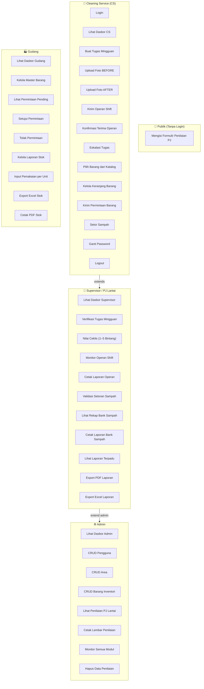

---

### 3.2 Use Case Detail — Modul Operan Shift

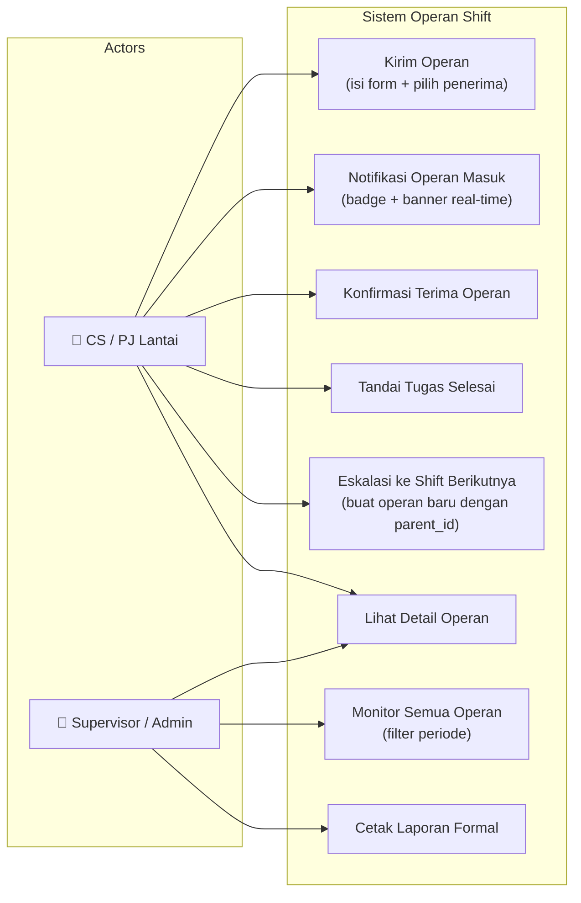

---

## 4. Activity Diagram

### 4.1 Alur Tugas Mingguan CS

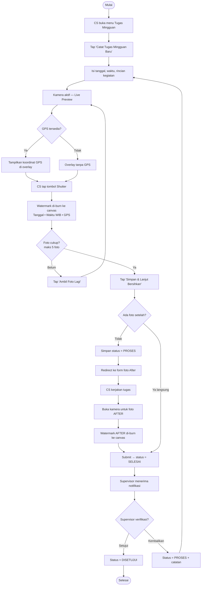

---

### 4.2 Alur Operan Shift

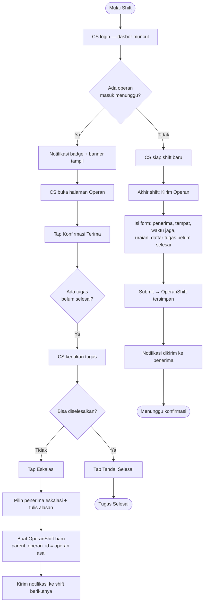

---

### 4.3 Alur Permintaan Barang

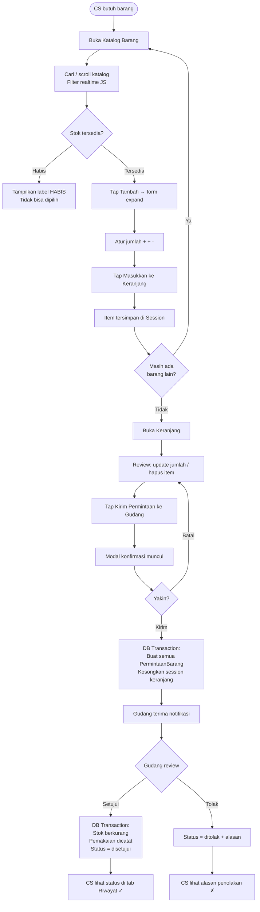

---

### 4.4 Alur Bank Sampah

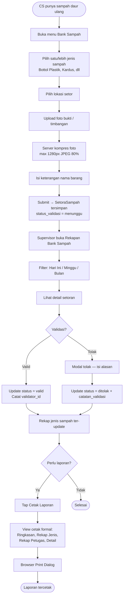

---

### 4.5 Alur Penilaian Kinerja PJ Lantai (Publik)

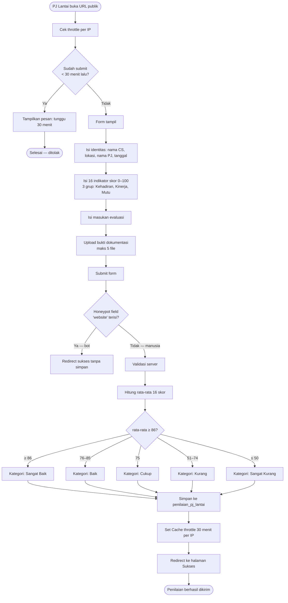

---

## 5. Sequence Diagram

### 5.1 Alur Login dan Auto-Redirect

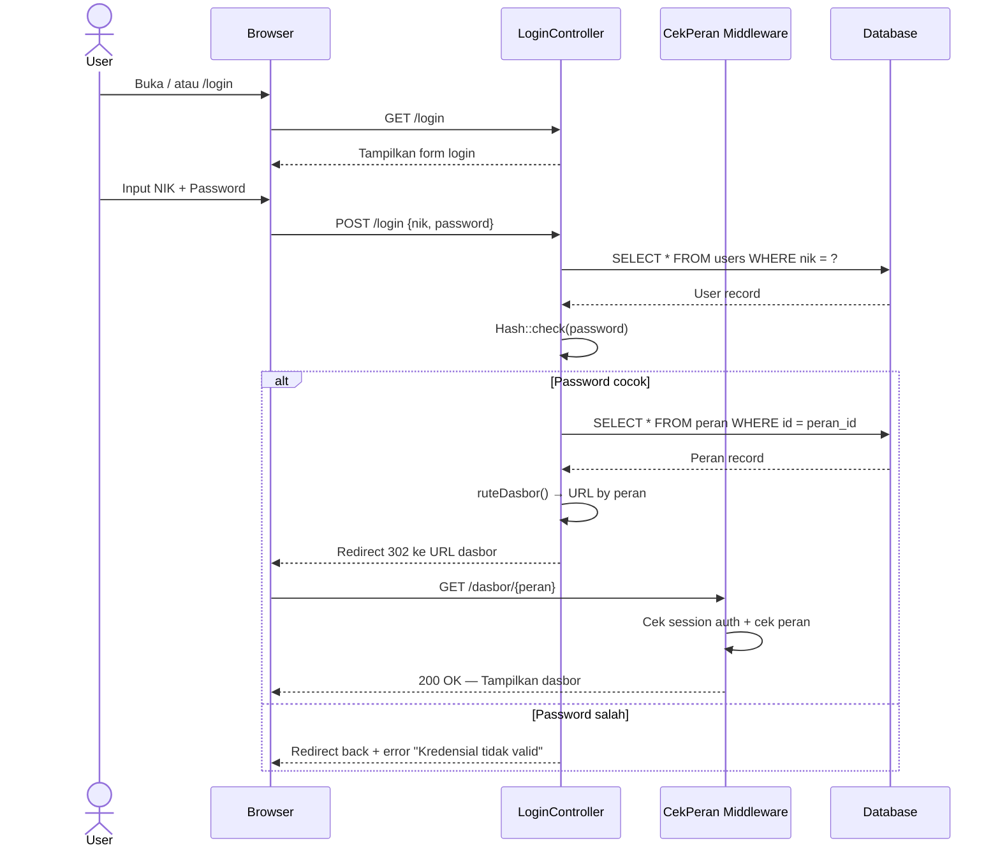

---

### 5.2 Alur Upload Foto dengan Watermark dan Kompresi

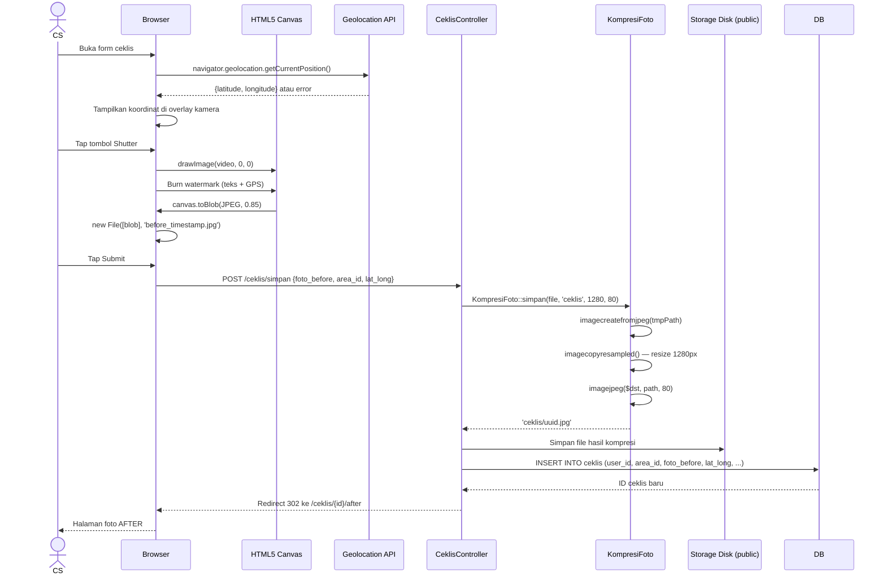

---

### 5.3 Alur Persetujuan Permintaan Barang (DB Transaction)

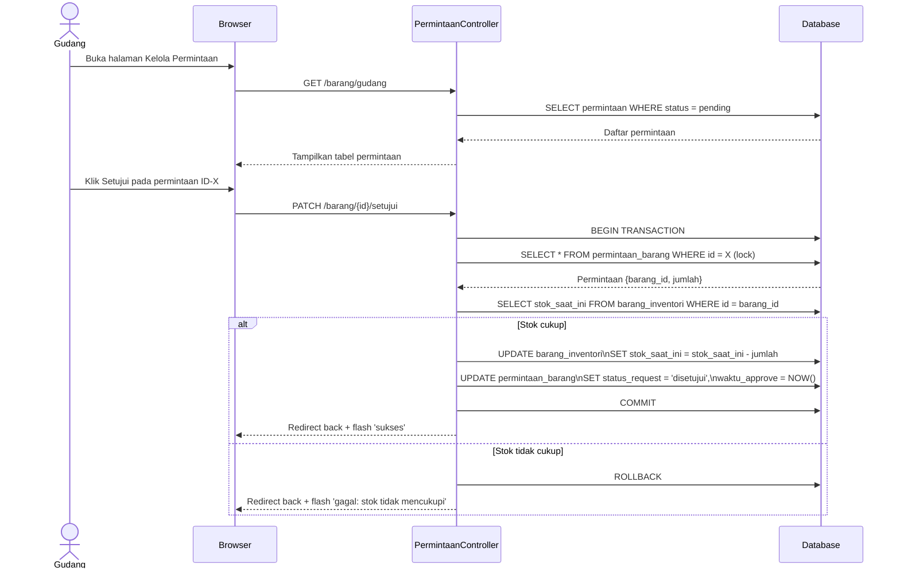

---

### 5.4 Alur Polling Notifikasi Operan (Real-time)

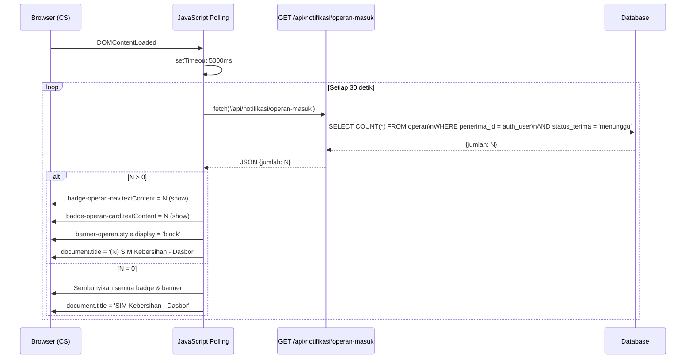

---

### 5.5 Alur Operan Shift + Eskalasi

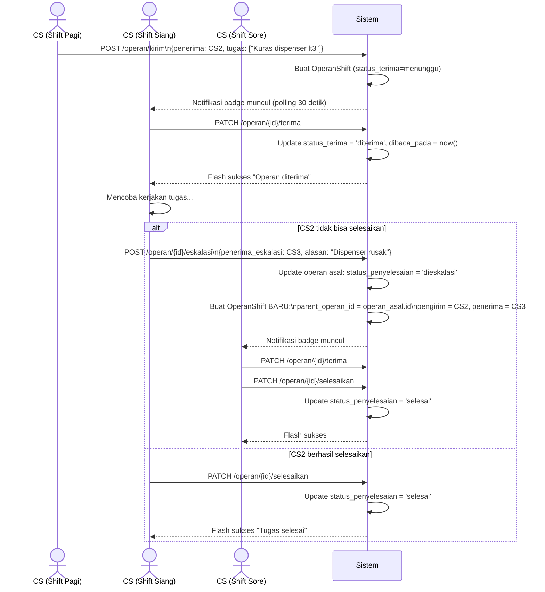

---

## 6. Class Diagram

### 6.1 Class Diagram — Model Layer

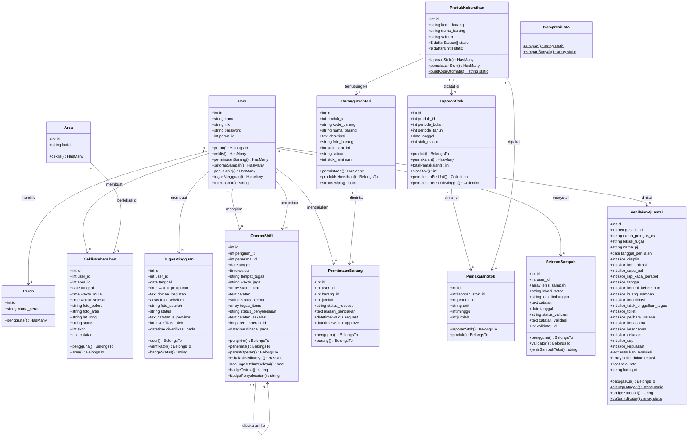

---

### 6.2 Class Diagram — Controller Layer

```mermaid
classDiagram
    class Controller {
        <<abstract>>
    }

    class DasborAdminController {
        +index() View
    }
    class DasborCsController {
        +index() View
    }
    class DasborSupervisorController {
        +index() View
    }
    class DasborGudangController {
        +index() View
    }

    class TugasMingguanController {
        +index(Request) View
        +buat() View
        +simpan(Request) Redirect
        +detail(id) View
        +isiAfter(id) View
        +simpanAfter(Request, id) Redirect
        +verifikasi(Request, id) Redirect
    }

    class CeklisKebersihanController {
        +index() View
        +buat(area_id) View
        +simpan(Request) Redirect
        +isiAfter(id) View
        +simpanAfter(Request, id) Redirect
        +detail(id) View
        +nilaiCeklis(Request, id) Redirect
    }

    class OperanShiftController {
        +index() View
        +kirim(Request) Redirect
        +terima(id) Redirect
        +selesaikan(id) Redirect
        +eskalasi(Request, id) Redirect
        +detail(id) View
        +cetakLaporan() View
        -monitoringOperan() View
    }

    class PermintaanBarangController {
        +katalog() View
        +addToCart(Request) Redirect
        +viewCart() View
        +updateCartItem(Request) Redirect
        +removeCartItem(Request) Redirect
        +clearCart() Redirect
        +submitCart() Redirect
        +daftarGudang() View
        +setujui(id) Redirect
        +tolak(Request, id) Redirect
        +showProof(id) Response
    }

    class SetoranSampahController {
        +buat() View
        +simpan(Request) Redirect
        +rekapan(Request) View
        +validasi(id) Redirect
        +tolak(Request, id) Redirect
        +cetakLaporan(Request) View
    }

    class LaporanController {
        +index(Request) View
        +cetakPdf(Request) Response
        +cetakExcel(Request) BinaryFileResponse
        -rentangWaktu(filter, bulan) array
    }

    class StokBarangController {
        +index(Request) View
        +simpanBarang(Request) Redirect
        +tambahKePeriode(Request) Redirect
        +updateLaporan(Request, id) Redirect
        +updatePemakaian(Request, id) JsonResponse
        +dataPemakaian(id) JsonResponse
        +hapusLaporan(id) Redirect
        +exportExcel(Request) BinaryFileResponse
        +cetakPdf(Request) View
        +kodeOtomatis() JsonResponse
        -namaBulan() array
    }

    class PenilaianPjPublicController {
        +index() View
        +store(Request) Redirect
        +sukses() View
    }

    class GantiPasswordController {
        +edit() View
        +update(Request) Redirect
    }

    Controller <|-- DasborAdminController
    Controller <|-- DasborCsController
    Controller <|-- DasborSupervisorController
    Controller <|-- DasborGudangController
    Controller <|-- TugasMingguanController
    Controller <|-- CeklisKebersihanController
    Controller <|-- OperanShiftController
    Controller <|-- PermintaanBarangController
    Controller <|-- SetoranSampahController
    Controller <|-- LaporanController
    Controller <|-- StokBarangController
    Controller <|-- PenilaianPjPublicController
    Controller <|-- GantiPasswordController
```

---

## Ringkasan Statistik Sistem

| Komponen | Jumlah |
|---|---|
| Tabel Database Aktif | 16 tabel |
| Model Eloquent | 13 model |
| Controller | 15 controller |
| Total Route | 96 route |
| Peran Pengguna | 5 peran + publik |
| Export Class | 2 class (PDF + Excel per modul) |
| Helper Class | 1 (`KompresiFoto`) |
| View Template | 40+ blade files |
| Layout | 2 (Sidebar + Mobile UI) |

---

*Dokumen ini dibuat otomatis berdasarkan implementasi aktual sistem per September 2026.*  
*Seluruh diagram menggunakan sintaks **Mermaid** — dapat dirender di GitHub, GitLab, Notion, Obsidian, dan VS Code (plugin Mermaid Preview).*
